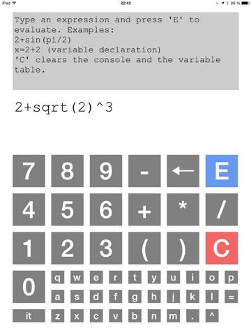

Every programmer must write a text calculator. This is mine.

Currently the calculator supports:
- Binary operators (+, -, *, /, ^)
- Functions (sin, cos, ...)
- Variable assignment (e.g x=5)
- Last result bound to the variable `it`

There are two versions: console (Haskell) and iOS (Java + Scala + RoboVM).

